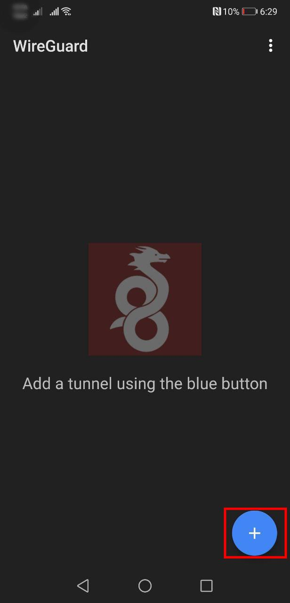
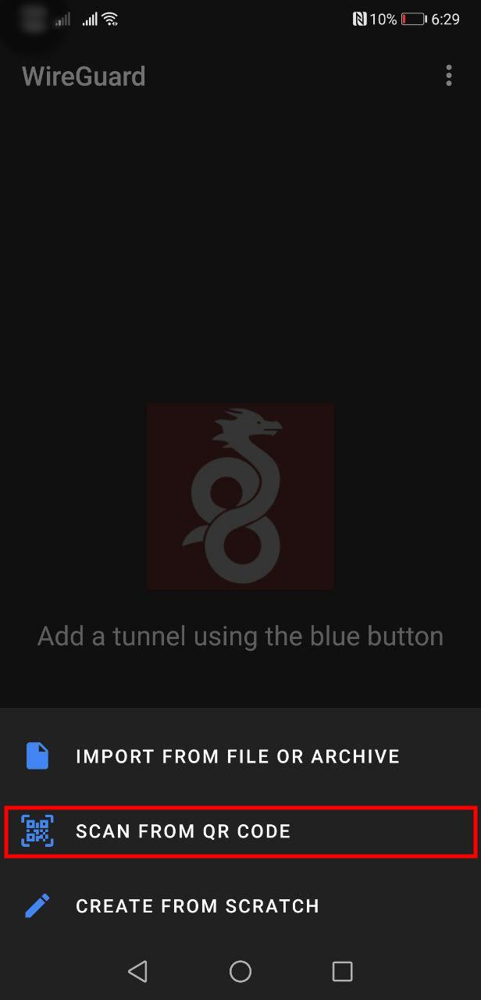
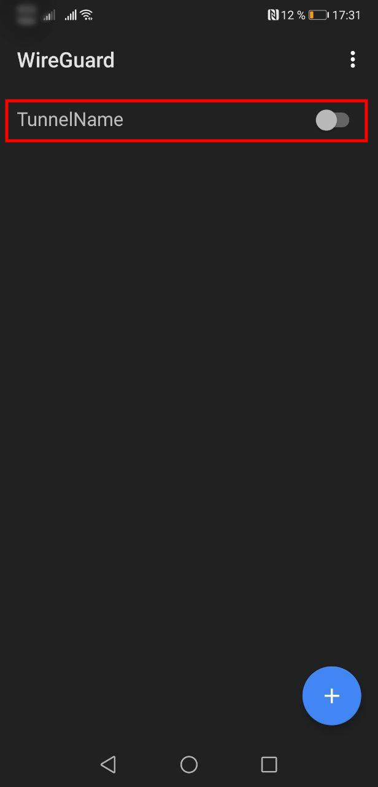

# Mobile devices

_Note: iOS and Android clients are very similar, so we describe only the Android one client here._

0. [Create the peer](../README.md#add-a-vpn-peer). Do not close the pop-up window with QR-code!

1. Download the official app for your platform: [iOS &rarr;](https://apps.apple.com/us/app/wireguard/id1441195209?ls=1), [Android &rarr;](https://play.google.com/store/apps/details?id=com.wireguard.android).

2. Open the app, click "add a tunnel" and choose "Scan from QR code" option:

    

3. Scan the QR-code on the Peers page, give it a name and save:

    

4. Allow to add the VPN configuration for your operating system.

5. Connect to the VPN:

    

